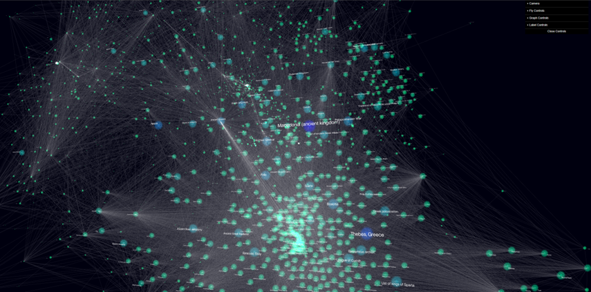
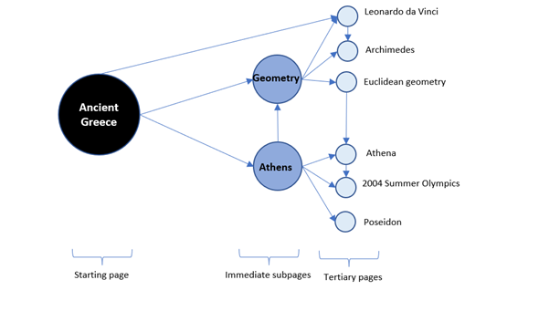
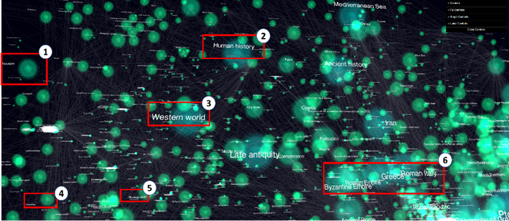
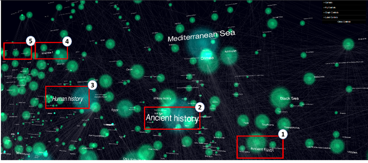
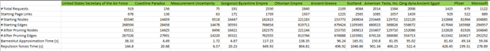

# Creating and browsing the Wikipedia ecosphere

#### 1/2/2022

## The search for knowledge...

Buzzwords like machine learning, Artificial Intelligence (AI), and deep neural networks are being thrown around left and right in today’s conversational circles, but it’s hard to pin down exactly why this new paradigm of data processing works and what it does for us. In fact, AI explainability is one of the most questioned, researched, and published topics of 2021[1], and rightly so. It’s easy to make computers chug through mass amounts of data, spit out charts, and tell you an “accuracy” score, but hard to make human sense out of it all. Throughout the years, humans have done a good job chugging through mass amounts of data, too. We’ve compressed and compiled our knowledge and interpretations into meaningful morsels by way of the pen – some of you might remember those things called “books.” 
However, the internet age has brought a new paradigm with unlimited, unprecedented, and accelerated access to information. Now, we have access to the extreme ends of the worlds knowledge but are challenged in effectively consuming it. Our personal hunting and gathering methods have expanded from essays to PowerPoints, novels to movies, and encyclopedias to Wikipedia.org.  The new methods of conveying information are more immersive, digestible, and impactful per time quanta, than books. 
On weekends, I like to do mini “Wikipedia exploration” sessions in which I let my curiosity drive.  Recently, I faced impatience on a quest to obtain a “gist” of Ancient Greece, which contains 1,225 hyperlinks to other Wikipedia pages. Far too many for me to click through. In comparison, the English version of Wikipedia has 5.7 million pages, or 2698 physical volumes with 500 pages each (not including images) [2]. A truly monolithic encyclopedia. Fantastic work, Humans, but that won’t fit on my coffee table.
I thought, instead of clicking on each page, what if I could view 100K Wikipedia pages at once, and explore the “Wikipedia ecosphere” of Ancient Greece in both a fun and educational way? 

## ...led to this:

Using three.js[7] as a renderer to explore the ecosphere, we can find globs of nodes corresponding to people, connected to Candaules, and peninsulas of cities, connected to Athens, and most importantly, the pages that are most interconnected among all of the ecosphere, appear in the center like giant stars in the galaxy. They are the critical pillars to the question “what is Ancient Greece with respect to Wikipedia?”
So how do we get there?

## But how did we get there?
**Wrangle Data**

First, we need a way to gather and wrangle all the data. We can use Wikipedia’s API to programmatically visit each page and extract all the hyperlinks. Starting out, we ask the computer to visit the main page, Ancient Greece, and it will find 1,225 hyperlinks to other Wikipedia pages. Then, we ask, for each of those links, visit each page and bring back another set of links. In applying that logic for the initial seed of Ancient Greece, we end up with ~150K nodes in the system. I would say, the ecosphere of Ancient Greece contains ~150K Wikipedia pages. Although Ancient Greece is a rather large Wikipedia page, others vary wildly in the number of hyperlinks they contain. Some are a mere 3-4 starting links, like Eunomous (king of Sparta), while others can get up to 3000[3], like Scotland. I have found that each hyperlink on the seed page will lead to 125x total nodes in the system (for three degrees of freedom). But our goal is to understand Ancient Greece - how can we do it quickly, effectively, visually, and at a macro level?

**Model It**

Second, we need a framework to organize our data. If our goal is to amass the “knowledge of the interrelated” our likely friend is the Graph model. Graph models allow us to analyze, visualize, and interpret complex relational structures backed by mathematical principles dating back to Leonhard Euler. We can model each node as a Wikipedia page, and each connection (or “edge”) between nodes as a hyperlink between Wikipedia pages. 
If we visit the Ancient Greece Wikipedia page, for example, we will find links to related pages including Athens, Geometry, Phoenicia, and Candaules who was a King in the ancient kingdom of Lydia. Below is a subset of a Graph depicting Ancient Greece – it is a formal math and data structure – but I hope it is intrinsically familiar to you.  

 
## So, we have data and a data structure. Now what?
**Compute**

The secret is to use ForceAtlas2[4][5], a physics based layout algorithm to spatialize and visualize the graph structure. If we add in a little bit of coloring and sizing based on PageRank[6] (another graph theoretic measure), we can turn the already intuitive and tactile graph model into a compelling visualization. Once computed and rendered to the screen, we can see artifacts of continuous clustering across the ecosphere, forming loose groupings of related Wikipedia pages. At a high level, the algorithm works by repulsing lower density nodes and attracting higher density (or highly interconnected) nodes. For example, Phoenicia and Athens are clustered together because they share a wide range of hyperlinks, while Athens and Geometry are relatively distant as they do not share as many direct links. You can proxy a vision of layout computation process as an “oil separating from water” simulation. What we’re doing here is not science, per se, but art with a little help from computers.  

**Results**

Upon exploration, the Wikipedia pages emerge in self organizing patterns roughly modeling “relatedness.” The most exciting pattern is that linear traversal offers a logical leap from one topic to the next. For example, in [Figure 1], as we linearly traverse from the cluster of ancient empires towards “Populism,” we encounter the “Western World.” That means that the “Western World” is in a logical pathway to “Populism.” The best part is that it is purely visual. No obscure metrics to decipher here. The ForceAtlas2 layout over a Wikipedia subset appears to present a logical linear pathway between two arbitrary nodes.
 

[Figure 1] Subset of ecosphere of Ancient Greece: (1) Populism, (2) Human History, (3) Western World, (4) Liberalism, (5) Renaissance, (6) cluster of Byzantine Empire, Roman Empire, Greece, and Roman Italy

Again, in [Figure 2], moving from “Ancient Egypt” to the “Cold War,” we encounter Ancient History, Human History, World War II and then the Cold War, in that order. Constrained by discrete Wikipedia pages, the linear and logical traversal is astounding. 
 

[Figure 2] Subset of ecosphere of Ancient Greece: (1) Ancient Egypt, (2) Ancient History, (3) Human History, (4) World War II, (5) Cold War

It is reminiscent of the Wikipedia Game[8] in which online players race to traverse a subset of the Wikipedia ecosphere between pages in hopes of arriving at the desired page first. The mental strategy while playing is to make logical leaps between hyperlinks, arriving at the destination node in the fewest clicks.
Conclusion | So that’s it. A simple AI method with no neural networks in sight. Neural networks are just a class of statistical algorithms geared for compression, anyway. Instead, we chugged through ~150 books on Ancient Greece and used the power of graph models to compress our findings into one image. Best of all, it is logical and explainable. First, we used Wikipedia’s API to visit thousands of Wikipedia pages and scrape the links. Then, we thought about the best way to represent the information and selected a Graph as our data model. Lastly, we visualized the dense network using modern web technology. But without ForceAtlas2, my favorite spatialization and layout algorithm, we would not have earned the compelling, punchy, and explorable visualization. The great Wikipedia encyclopedia made accessible to coffee table curiosities once again.
Where do we go from here? | In essence, what I’ve shown here is a tool and framework for understanding and explaining generalized dense networks. The method could be a tool for researchers to explore the ecosphere of citations and papers in his/her field of work, used by lawyers to undertake a body of existing judgements and legislation, or even stay as a fun way to browse Wikipedia on weekends. Any which way, using the tool feels a little bit like browsing in a bookstore: even if you don’t open every book, a walk through the history aisle is a high-level history lesson. 
 
References:
- [1] https://opendatascience.com/best-deep-learning-research-of-2021-so-far/
- [2] https://wikiwaze.com/index.php/2018/09/07/how-big-is-wikipedia/
- [3] Primary research:  

- [4] https://journals.plos.org/plosone/article?id=10.1371/journal.pone.0098679
- [5] https://github.com/bhargavchippada/forceatlas2
- [6] https://networkx.org/documentation/stable/reference/algorithms/generated/networkx.algorithms.link_analysis.pagerank_alg.pagerank.html
- [7] https://threejs.org/
- [8] https://www.thewikigame.com/

 

